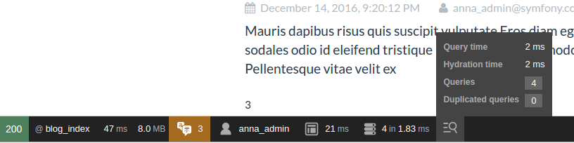
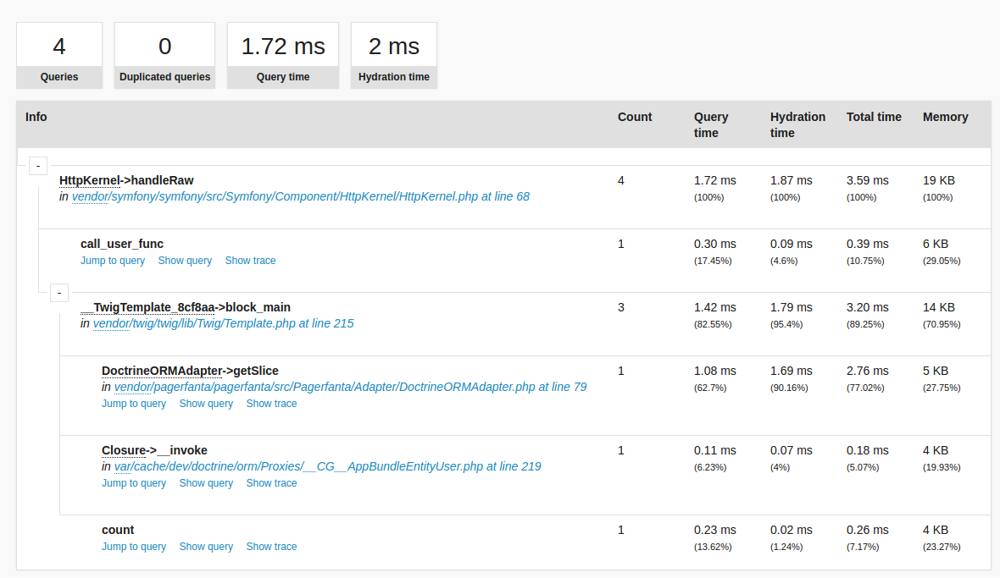
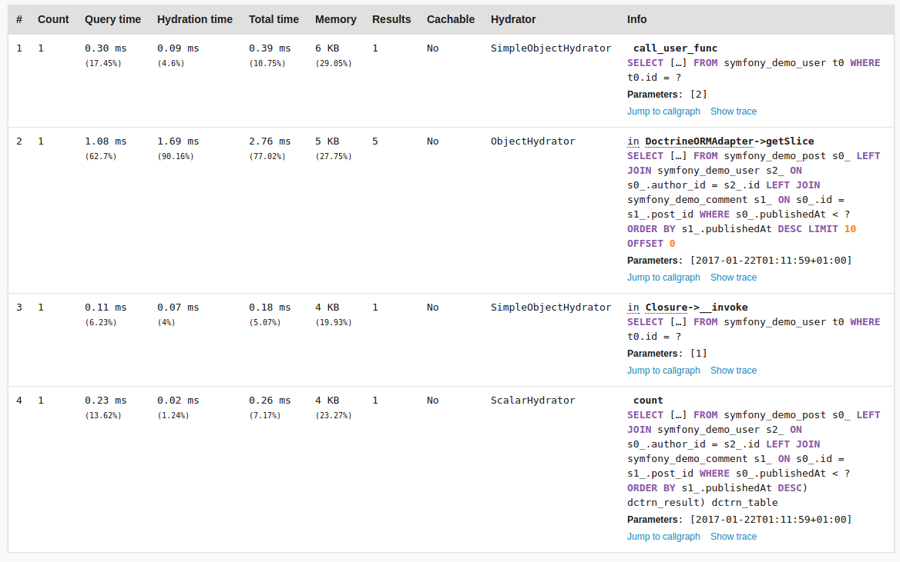
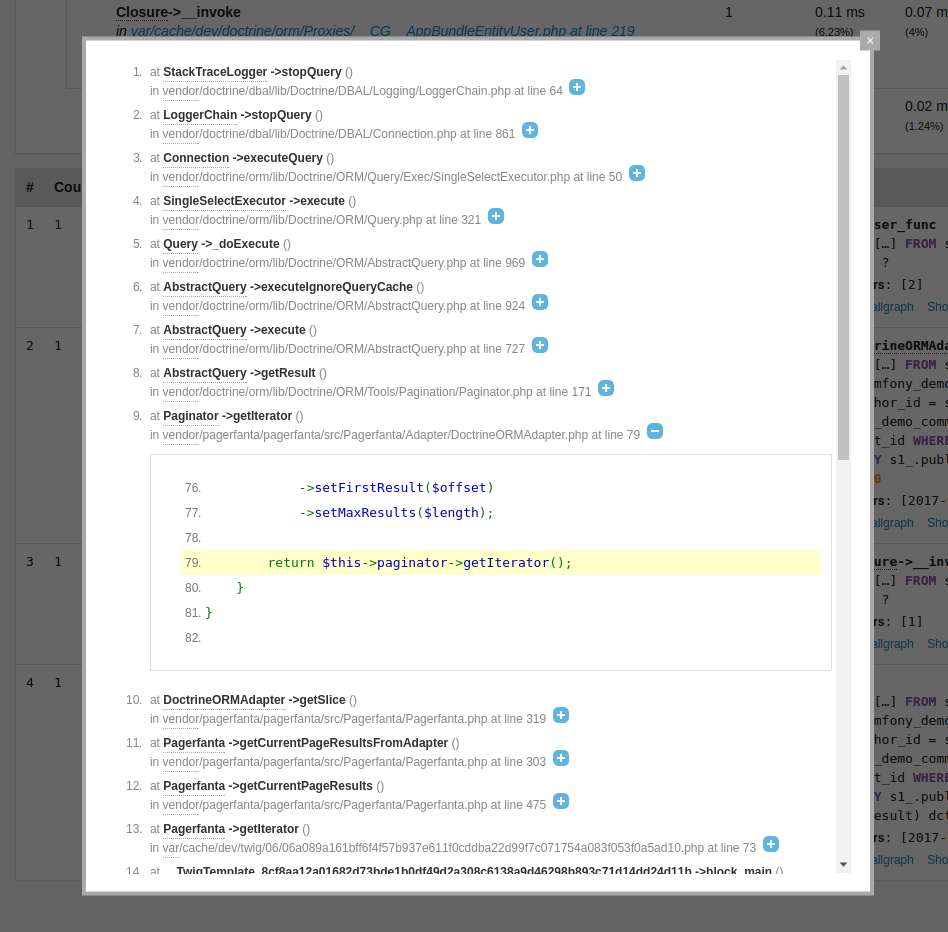

PIXERS Doctrine Profiler Bundle
===============================
PixersDoctrineProfilerBundle enables new panel in Symfony debug toolbar that allows
you to profile performance of your database queries.

It provides extensive information about Doctrine queries execution time and memory. It also
allows you to spot inefficient places of your application by showing _hot spots_ in a call graph.

**Features:**

- **Detailed query profile**
    - Memory usage
    - Cache info
    - Duplicated queries detection

- **Hydration profiling**
    - Type and time of hydration
    - Visualization in performance panel (execution timeline)

- **Query origin**
    - Call graph with metrics aggregated across code
    - Stacktrace of the queries

Installation
------------

Installation is a two step process.

1. Install this bundle using Composer:

```bash
$ composer require pixers/doctrine-profiler-bundle
```

2. Enable bundle in AppKernel (_only in dev and test environments_):

```php
// in AppKernel::registerBundles()

if (in_array($this->getEnvironment(), array('dev', 'test'))) {
    // ...
    $bundles[] = new Pixers\DoctrineProfilerBundle\PixersDoctrineProfilerBundle();
}
```

Screens
-------

### Toolbar:



---

### Call graph:


---

### Queries:


---

### Stacktrace:




About
-------

DoctrineProfilerBundle is an initiative of [PIXERS](http://pixersize.com):

* Bartłomiej Ojrzeński <bartlomiej.ojrzenski@pixers.pl>
* Antoni Orfin <antoni.orfin@pixers.pl>

License
-------

Copyright 2017 PIXERS Ltd - www.pixersize.com

Licensed under the [BSD 3-Clause](LICENSE)